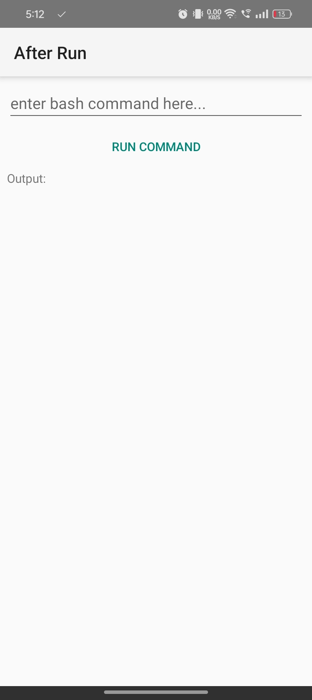
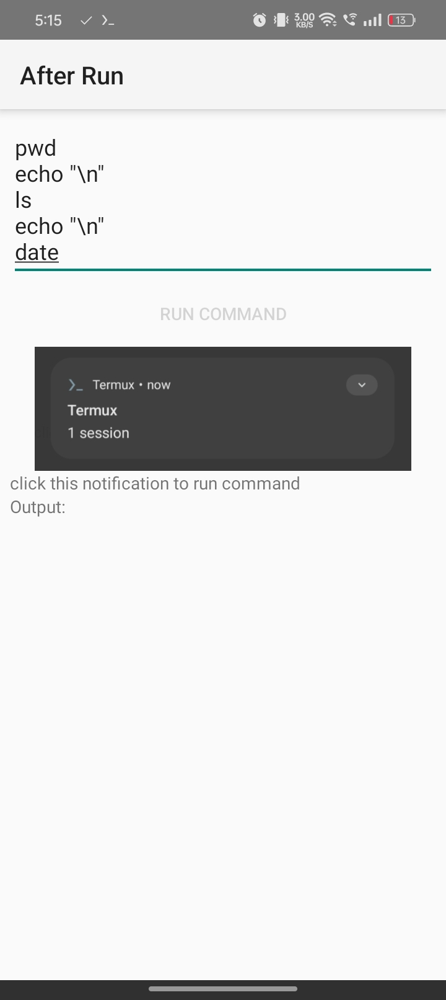

# AfterRun
app that sends command to Termux

| 1 | 2 
|:-------:|:-------:|
|  | 

<br>

## Making it work
- must have [Termux](https://f-droid.org/en/packages/com.termux/) and [Termux:API](https://f-droid.org/en/packages/com.termux.api/ ) installed
- must have run this command on Termux first:
- ```
  pkg install termux-api
  sed -i 's/# allow-external-apps = true/allow-external-apps = true/g' ~/.termux/termux.properties
  termux-setup-storage
  ```

<br><br>

## Troubleshooting
#### app crashes instantly when opened:
- ensure you have [Termux](https://f-droid.org/en/packages/com.termux/) and [Termux:API](https://f-droid.org/en/packages/com.termux.api/ ) installed.

<br><br><br>

## Edit this AfterRun project
- this is an AIDE project
- which means it can only be build using [AIDE](https://www.android-ide.com/)
- but the code is java so its compatible with Android Studio *if u are satisfied to copy and paste*
- no ```kotlin```, ```java version 8+```, ```appcompat```, ```androidx``` and ```any libraries``` is used. And it must remain not to be
- will have separate md file for this topic someday...
