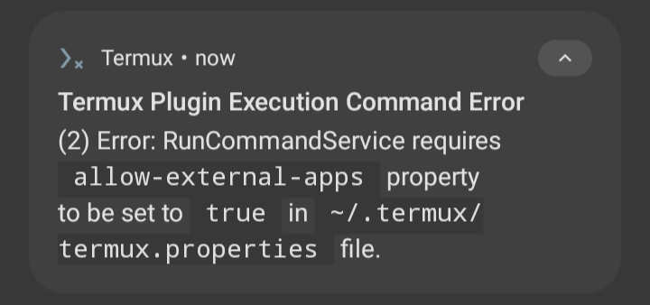

# AfterRun
android app that sends & receive command from Termux

| 1 | 2 
|:-------:|:-------:|
|  | 
## Download
comming soon...

<br>

## Making it work
must have [Termux](https://f-droid.org/en/packages/com.termux/) and [Termux:API](https://f-droid.org/en/packages/com.termux.api/ ) installed

must have run this command on Termux first:
```bash
pkg install termux-api
sed -i 's/# allow-external-apps = true/allow-external-apps = true/g' ~/.termux/termux.properties
termux-setup-storage
  ```

<br><br>

## Troubleshooting
#### app crashes instantly when opened:
<details>
  <summary>Solution:</summary>
  
ensure you have [Termux](https://f-droid.org/en/packages/com.termux/) and [Termux:API](https://f-droid.org/en/packages/com.termux.api/ ) installed.
<details>
  <summary>Why did it happen:</summary>
  
a termux permission is set on AndroidManifest. The app will crash instantly if termux is not installed
  
</details>
</details>

#### Error: Termux Plugin Execution Command Error

<details>
  <summary>Solution:</summary>
  
you should run this command on Termux first:
```
  pkg install termux-api
  sed -i 's/# allow-external-apps = true/allow-external-apps = true/g' ~/.termux/termux.properties
  termux-setup-storage
  ```
NOTE: this might pop up again even if u already run it. just close the app and retry again
<details>
  <summary>Why did it happen:</summary>
  
termux:api has some requirements in order to run. like setting allow-external-apps to true in the hidden termux.properties file
  
</details> 
</details> 

#### Maybe open Termux first?

<details>
  <summary>Solution:</summary>
  
This is perfectly normal!<br>just open Termux and go back to the app again.
<details>
  <summary>Why did it happen:</summary>
  
termux:api has some requirements in order to run. like disabling battery optimization and granting draw over apps. Once you satisfy those, you might not get this dialog again
  
</details>
</details>

<br><br><br>

## Edit this AfterRun project
will have separate md file for this topic someday... 
- this is an AIDE project
- which means it can only be build using [AIDE](https://www.android-ide.com/)
- but the code is java so its compatible with Android Studio *if u are satisfied to copy and paste*
- no ```kotlin```, ```java version 8+```, ```appcompat```, ```androidx``` and ```any libraries``` please.
